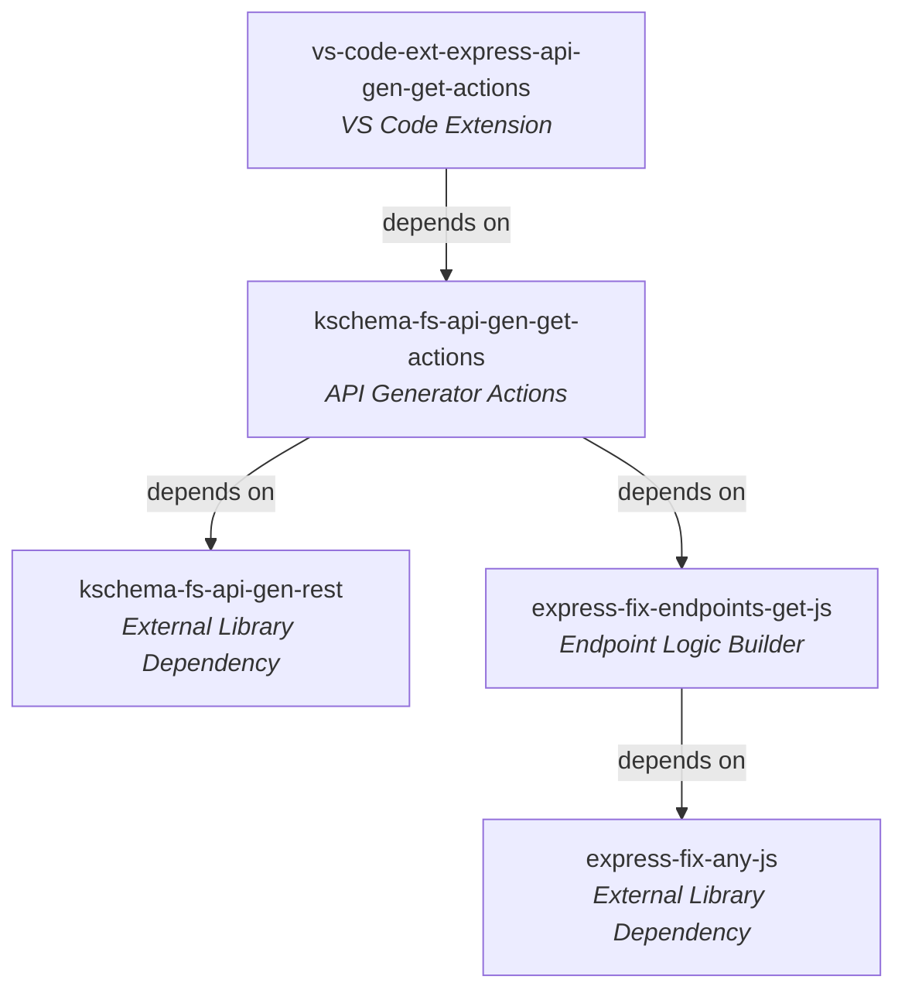
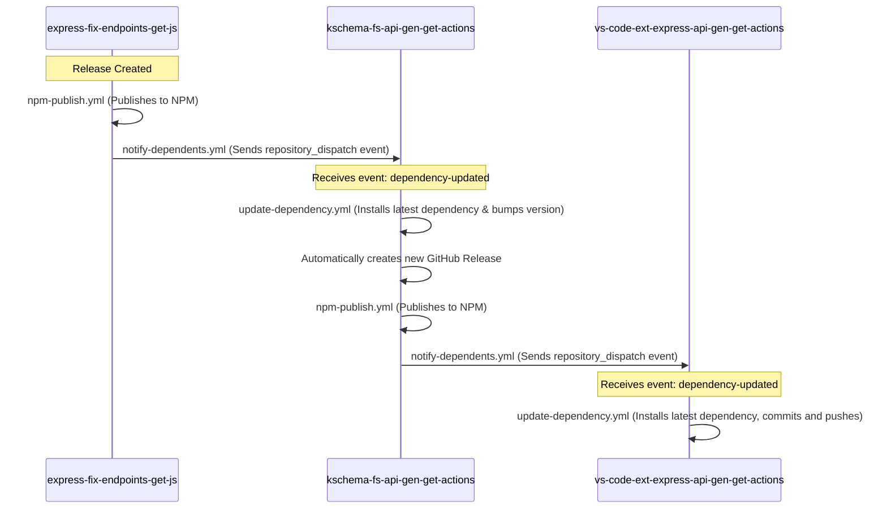

# Workspace Dependency & Release Workflow Structure

This document details the dependencies and the automated release orchestration between the three repositories in your workspace:
1. `express-fix-endpoints-get-js`
2. `kschema-fs-api-gen-get-actions`
3. `vs-code-ext-express-api-gen-get-actions`

---

## 1. Project Dependency Relationship

The repositories follow a strict, cascading dependency structure where the VS Code extension depends on the core generator actions, which in turn depends on the endpoint fixer library.



### Dependency Declarations

*   **[vs-code-ext-express-api-gen-get-actions package.json](../../vs-code-ext-express-api-gen-get-actions/package.json#L52-L54):**
    ```json
    "dependencies": {
      "kschema-fs-api-gen-get-actions": "^1.8.4"
    }
    ```
*   **[kschema-fs-api-gen-get-actions package.json](../package.json#L12-L15):**
    ```json
    "dependencies": {
      "express-fix-endpoints-get-js": "^1.5.5",
      "kschema-fs-api-gen-rest": "^1.8.2"
    }
    ```
*   **[express-fix-endpoints-get-js package.json](../../express-fix-endpoints-get-js/package.json#L12-L14):**
    ```json
    "dependencies": {
      "express-fix-any-js": "^1.5.3"
    }
    ```

---

## 2. Automated Cascading Release Chain

When a release is created in an upstream repository, GitHub Actions automatically handles publishing to NPM and triggers downstream updates.



---

## 3. Workflow Details

### 🟢 1. NPM Publish Workflow (`npm-publish.yml`)
*   **Files:**
    *   [express-fix-endpoints-get-js/npm-publish.yml](../../express-fix-endpoints-get-js/.github/workflows/npm-publish.yml)
    *   [kschema-fs-api-gen-get-actions/npm-publish.yml](../.github/workflows/npm-publish.yml)
*   **Trigger:** Runs on Github Release creation (`release: types: [created]`).
*   **Actions:** 
    1. Installs dependencies (`npm ci`).
    2. Publishes to NPM (`npm publish`) using the environment variable `NODE_AUTH_TOKEN: ${{secrets.NPM_TOKEN}}`.
    3. Triggers the notify-dependents step downstream.

### 🔵 2. Notify Dependents Workflow (`notify-dependents.yml`)
*   **Files:**
    *   [express-fix-endpoints-get-js/notify-dependents.yml](../../express-fix-endpoints-get-js/.github/workflows/notify-dependents.yml)
    *   [kschema-fs-api-gen-get-actions/notify-dependents.yml](../.github/workflows/notify-dependents.yml)
*   **Trigger:** Triggered directly by the NPM Publish workflow after a successful package deployment.
*   **Actions:**
    1. Pauses for 15 seconds to allow NPM replication.
    2. Sends a `POST` request to the target downstream GitHub repository's dispatches endpoint:
       `https://api.github.com/repos/keshavsoft/<downstream-repo>/dispatches`
    3. Uses event type `"dependency-updated"`.
    4. Authenticates with a Personal Access Token / Repo Dispatch Token (`secrets.REPO_DISPATCH_TOKEN`).

### 🟠 3. Update Dependency Workflow (`update-dependency.yml`)
*   **Files:**
    *   [kschema-fs-api-gen-get-actions/update-dependency.yml](../.github/workflows/update-dependency.yml)
    *   [vs-code-ext-express-api-gen-get-actions/update-dependency.yml](../../vs-code-ext-express-api-gen-get-actions/.github/workflows/update-dependency.yml)
*   **Trigger:** Listens to `repository_dispatch` with event type `[dependency-updated]`.
*   **Actions:**
    1. Pulls down code and runs `npm install <upstream-package>@latest`.
    2. **In `kschema-fs-api-gen-get-actions`:**
       * Bumps own version (`npm version patch --no-git-tag-version`).
       * Commits and pushes the change back to the repository.
       * Creates a new Git tag and pushes it.
       * Creates a GitHub Release, which automates triggering its own `npm-publish.yml` to loop the sequence to the final downstream extension.
    3. **In `vs-code-ext-express-api-gen-get-actions`:**
       * Commits and pushes the update back to the main branch (`git commit -m "Update kschema-fs-api-gen-get-actions to latest"`).
