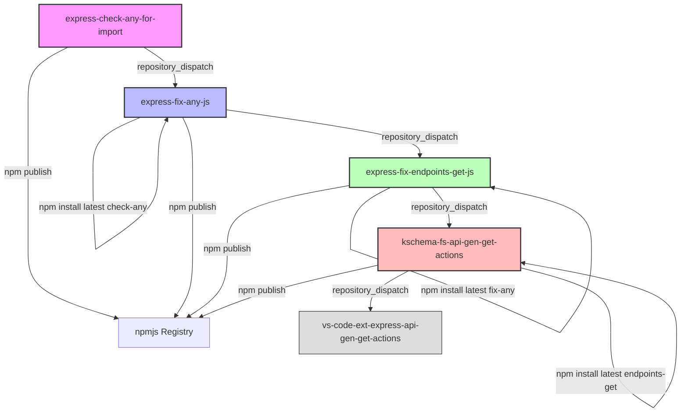

# CI/CD Workflows & Dependency Automation Documentation

This document details the dependencies and the automated release orchestration between the repositories in your workspace:
1. `express-check-any-for-import`
2. `express-fix-any-js`
3. `express-fix-endpoints-get-js`
4. `kschema-fs-api-gen-get-actions`

---

## 🏗️ High-Level Architecture & Propagation Flow

We have configured a cascading dependency update chain. When a base package is published to NPM, it automatically notifies its immediate downstream dependent, which automatically updates its dependency, commits the changes, and propagates the notification further down the chain.

---

## 📦 Detailed Repository & Action Breakdown

### 1. `express-check-any-for-import`
This is the root utility library analyzing JS imports.
* **[publish-and-notify.yml](file:///d:/KeshavSoftRepos/2026-07-14/ks1/express-check-any-for-import/.github/workflows/publish-and-notify.yml)** (Caller Workflow)
  * **Trigger**: Manual dispatch (`workflow_dispatch`) or GitHub Release publication.
  * **Action**:
    1. Installs dependencies (`npm ci`).
    2. Runs safety check: Queries NPM registry to check if the current package version already exists. If yes, it skips publishing. If no, it publishes the package to npmjs.
    3. Triggers `notify-dependents.yml`.
* **[notify-dependents.yml](file:///d:/KeshavSoftRepos/2026-07-14/ks1/express-check-any-for-import/.github/workflows/notify-dependents.yml)** (Reusable Callee Workflow)
  * **Action**: Waits 15 seconds (NPM registry replication delay) and then posts a `dependency-updated` event to `express-fix-any-js`.

---

### 2. `express-fix-any-js`
This is the CLI tool for applying import alterations.
* **[update-dependency.yml](file:///d:/KeshavSoftRepos/2026-07-14/ks1/express-fix-any-js/.github/workflows/update-dependency.yml)**
  * **Trigger**: Repository dispatch (`dependency-updated`) sent by `express-check-any-for-import`.
  * **Action**:
    1. Checks out the repository using `REPO_DISPATCH_TOKEN`.
    2. Installs latest `express-check-any-for-import` from NPM.
    3. Bumps its own version patch (e.g. `1.7.4` to `1.7.5`) if any changes were made.
    4. Commits and pushes the update back to `main`.
* **[publish-and-notify.yml](file:///d:/KeshavSoftRepos/2026-07-14/ks1/express-fix-any-js/.github/workflows/publish-and-notify.yml)** (Caller Workflow)
  * **Trigger**: Manual dispatch (`workflow_dispatch`) or GitHub Release.
  * **Action**:
    1. Builds and runs version safety check (skips publishing to NPM if version already exists).
    2. Calls `notify-dependents.yml` to notify `express-fix-endpoints-get-js`.
* **[notify-dependents.yml](file:///d:/KeshavSoftRepos/2026-07-14/ks1/express-fix-any-js/.github/workflows/notify-dependents.yml)** (Reusable Callee Workflow)
  * **Action**: Waits 15 seconds, then posts `dependency-updated` to `express-fix-endpoints-get-js`.

---

### 3. `express-fix-endpoints-get-js`
This package handles endpoint-specific generator logic.
* **[update-dependency.yml](file:///d:/KeshavSoftRepos/2026-07-14/ks1/express-fix-endpoints-get-js/.github/workflows/update-dependency.yml)**
  * **Trigger**: Repository dispatch (`dependency-updated`) sent by `express-fix-any-js`.
  * **Action**:
    1. Installs latest `express-fix-any-js`.
    2. Bumps its own version patch if updated.
    3. Commits and pushes to `main`.
* **[publish-and-notify.yml](file:///d:/KeshavSoftRepos/2026-07-14/ks1/express-fix-endpoints-get-js/.github/workflows/publish-and-notify.yml)** (Caller Workflow)
  * **Trigger**: Manual dispatch or GitHub Release.
  * **Action**:
    1. Performs publishing with safety check (skips if already published).
    2. Calls `notify-dependents.yml` to notify `kschema-fs-api-gen-get-actions`.
* **[notify-dependents.yml](file:///d:/KeshavSoftRepos/2026-07-14/ks1/express-fix-endpoints-get-js/.github/workflows/notify-dependents.yml)** (Reusable Callee Workflow)
  * **Action**: Waits 15 seconds, then posts `dependency-updated` to `kschema-fs-api-gen-get-actions`.

---

### 4. `kschema-fs-api-gen-get-actions`
This is a generator generating actions.
* **[update-dependency.yml](file:///d:/KeshavSoftRepos/2026-07-14/ks1/kschema-fs-api-gen-get-actions/.github/workflows/update-dependency.yml)**
  * **Trigger**: Repository dispatch (`dependency-updated`) sent by `express-fix-endpoints-get-js`.
  * **Action**:
    1. Installs latest `express-fix-endpoints-get-js`.
    2. Bumps version patch and commits/pushes to `main`.
* **[publish-and-notify.yml](file:///d:/KeshavSoftRepos/2026-07-14/ks1/kschema-fs-api-gen-get-actions/.github/workflows/publish-and-notify.yml)** (Self-contained Workflow)
  * **Trigger**: Manual dispatch or GitHub Release.
  * **Action**:
    1. Runs NPM version safety checks and publishes to NPM.
    2. **Directly** waits 15 seconds and notifies `vs-code-ext-express-api-gen-get-actions` via curl, without calling separate/external workflow actions.

---

## 🔒 Required Secret Settings
For these workflows to function, ensure the following GitHub secrets are set:
1. **`NPM_TOKEN`**: A Granular or Classic NPM token with write access to publish packages.
2. **`REPO_DISPATCH_TOKEN`**: A GitHub Personal Access Token (PAT) with `repo` permissions to allow cross-repo workflow triggers and git push permissions.
